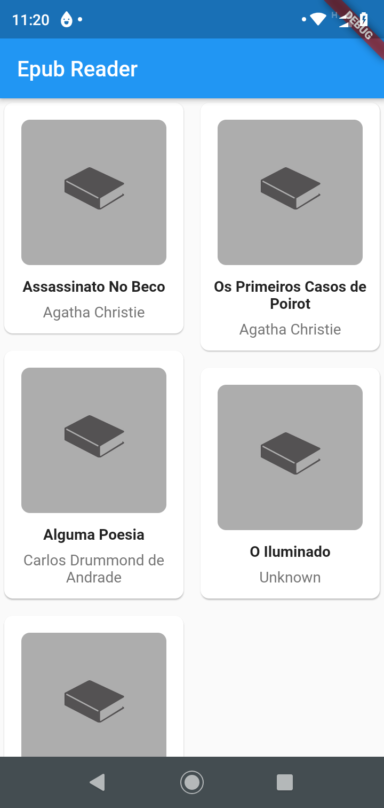
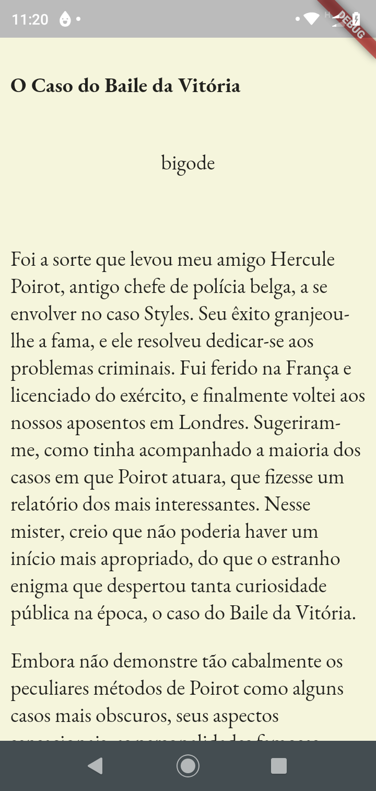

# Epub Reader

A simple epub reader made using Flutter (Android)

## Tech

- BLoc Pattern
- [Permission Handler](https://pub.dev/packages/permission_handler)
- [Staggared Grid View](https://pub.dev/packages/flutter_staggered_grid_view)
- [Epub Parser](https://pub.dev/packages/epub)
- [RxDart](https://pub.dev/packages/rxdart)
- [Flutter Html](https://pub.dev/packages/flutter_html)
- [Carousel Slider](https://pub.dev/packages/carousel_slider)
- [Flutter Launcher Icons](https://pub.dev/packages/flutter_launcher_icons)

## Screenshots

